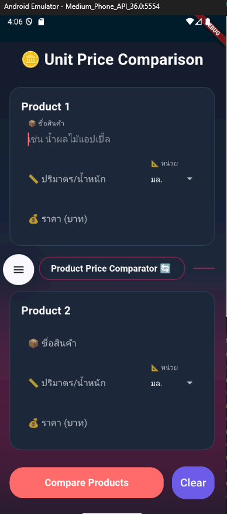
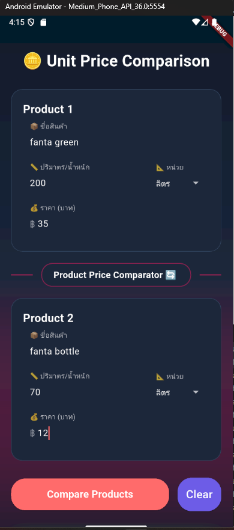
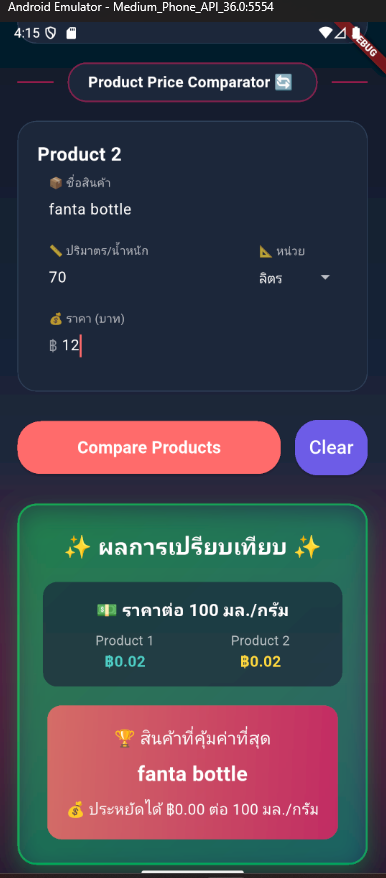

# Product Price Comparator APP

แอปนี้เขียนด้วย Flutter เพื่อศึกษาและฝึกเขียน Flutter สร้างแอปที่ช่วยเปรียบเทียบราคาสินค้าจากหลายแพ็กเกจ  

**คำอธิบายโปรเจกต์ (Project Description)**  
Product Price Comparator เป็นแอปมือถือที่ช่วยให้ผู้ใช้สามารถกรอกข้อมูลจำนวนชิ้นและราคาของสินค้าหลายขนาดแพ็กเกจ จากนั้นคำนวณราคาต่อหน่วยและแนะนำแพ็กเกจที่คุ้มค่าที่สุดให้ทันที เหมาะสำหรับ  
- ผู้ที่ช้อปปิ้งออนไลน์หรือซูเปอร์มาร์เก็ต ต้องการตัดสินใจซื้อสินค้าหลายขนาดแพ็กเกจ  
- นักเรียน นักศึกษา หรือใครก็ตามที่อยากฝึกคำนวณ และเรียนรู้การใช้งาน Flutter  

**จุดเด่น (Key Highlights)**  
- อินเทอร์เฟซใช้งานง่าย: กรอกข้อมูลในฟอร์มเดียว เลื่อนดูแพ็กเกจทั้งหมดได้  
- คำนวณทันใจ: กดปุ่ม “Compare” เพื่อคำนวณราคาต่อหน่วยในพริบตา  
- ผลลัพธ์ชัดเจน: แสดงราคาต่อหน่วย พร้อมไฮไลต์แพ็กเกจที่คุ้มค่าที่สุด  
- รองรับ Dark/Light Theme: ปรับโหมดสีตามที่ผู้ใช้ชื่นชอบ  
- ขยายได้ง่าย: โค้ดโครงสร้างชัดเจน เหมาะสำหรับเพิ่มฟีเจอร์ในอนาคต  

---

## 🔥 Features

- เปรียบเทียบราคาต่อหน่วยระหว่างแพ็กเกจขนาดต่างๆ  
- ใส่ข้อมูลชื่อสินค้า, จำนวนชิ้น, ราคา  
- แสดงผลว่าแพ็กเกจใดคุ้มค่าที่สุด  

---

## 📱 Demo Screenshots

 
  
  

---

